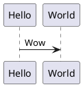

# Typst PlantUML

A simple tool that detects changes to Typst code and uses inline PlantUML to generate diagrams.

## Usage

On most systems, you can simply install via cargo:

```bash
cargo install --path . --locked
```

Then just run with `typst-plantuml <some directory>`.

Nix support will come very soon.

### Typst Code

Inside of a typst document, you can then do something like:
````typst
#if false [

]
#image("test.svg")
````

Note that the conditional is used to hide the code block without removing it fromt the AST (like a comment would).
